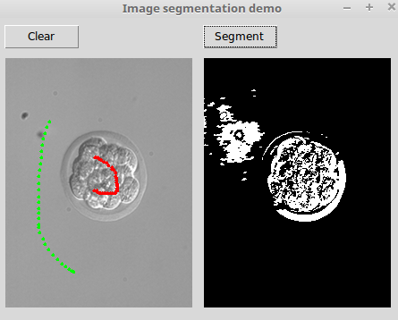

# Graph Cut Demo

Работа демонстрирует алгоритм сегментации изображений на основе
минимального разреза графа.

## Установка

Зависимости:

- numpy
- Cython
- pymaxflow (https://github.com/Rhoana/pymaxflow)
- Pillow

``` bash
python -m pip install -r requirements.txt
```

Проверена работа в ОС Ubuntu 16.04. Запуск под Windows может вызвать трудности
с установкой необходимых библиотек.

## Запуск

``` bash
python graph_cut.py <path to image>
```

От пользователя требуется выделить с помошью мыши два опорных
множества пикселей - для переднего плана и фона. Передний план
выделяется при зажатой левой кнопке мыши, фон - при зажатой
правой кнопке. После выделения следует нажать кнопку "Segment".
Для сброса разметки и сегментации можно использовать кнопку
"Clear".

## Принцип работы

Рассматривается граф `G = (V, E)`, где `V` - множество вершин графа,
`Е` - множество ребер. В ходе работы алгоритма выполняется построение этого
графа и нахождение в нем разреза, минимизирующего целевую функцию стоимости,
которая определяется как сумма весов ребер, через которые проходит разрез,
т.е.

`C(A, B) = sum(w(a, b) for a in A, b in B)`.

Двойственной задачей к задаче поиска минимального разреза в графе является
поиск максимального потока. Существует множество алгоритмов нахождения
минимального разреза или максимальнго потока в графе.

### Последовательность действий алгоритма

Вход:
- изображение, 3-мерный массив формы `(H, W, C)`
- два опорных множества пикселей для фона и переднего плана

Выход:
- изображение, 2-мерный бинарный массив формы `(H, W)`

1. Создается граф из входного изображения.

    Вершинами графа являются пиксели, назовем из нетерминальными вершинами.
    К ним добавляются две терминальные вершины - исток и сток. Таким образом,

    `|V| = H x W + 2`

2. Задаются ребра графа.

    Это действие может выполняться различными способами.
    Граф является ориентированным и взвешенным, т.е. для каждой вершины
    рассматриваются входящие и исходящие ребра, имеющие некоторые веса.
    Ребра имеются:
    - между соседними нетерминальными вершинами
    - между нетерминальными и терминальными вершинами
    Таким образом, `|E| <= (8 + 2) * H x W`, где 8 - максимальное число связей
    одной вершины с соседними.

    ```
     o  o  o
      \ | /
    o — o — o
      / | \
     o  o  o
    ```

3.  Сначала определим веса ребер между соседними нетерминальными вершинами.
    Могут использоваться разные интерпретации соседства:
    4-связное или 8 свзяное. Соответственно, количество ребер у вершины будет
    4 или 8.

    Веса между вершинами имеют смысл похожести между вершинами. Для этого можно
    использовать любую метрику. В данной работе используется метрика вида:

    ```
    w(u, v) = exp(-0.5 * q^2 * ||u - v|| ^ 2)
    ```

4.  Далее, определим веса ребер между нетерминальными и терминальными вершинами.

    Эти веса удобно рассматривать как априорные условные вероятности пикселей
    изображения попасть в классы фона и переднего плана. Пусть `A` и `B` -
    опорные множества пикселей фона и переднего плана, тогда:

    ```
                  P(u | A)
    Pa(u) = -------------------
            P(u | A) + P(u | B)

    Pa(u from A) = 1
    Pa(u from B) = 0
    ```

    ```
                  P(u | B)
    Pb(u) = -------------------
            P(u | A) + P(u | B)

    Pb(u from A) = 0
    Pb(u from B) = 1
    ```

    Для задания этих весов также можно использовать произвольную формулу.
    В данной работе используются формулы:

    ```
    wa(u) = -r * log(Pb(u))
    wa(u from A) = +inf
    wa(u from B) = 0
    ```

    ```
    wb(u) = -r * log(Pa(u))
    wb(u from A) = 0
    wb(u from B) = +inf
    ```

    Для определения условных распределений плотностей
    вероятностей строятся гистограммы опорных множеств. Ребрам присваиваются
    плотности вероятности из полученных гистограмм.

5.  Разрез графа.

    К этому этапу уже имеется сформированный граф. Для нахождения минимального
    разреза, т.е. разделения вершин графа на два непересекающихся и непустых
    подмножества вводится целевая функция. Фунция определяется как сумма весов
    ребер графа, через которые проходит разрез. Задача состоит в поиске
    глобального минимума этой функции. Стоит отметить, что всего существует
    `2 ^ |V|` разрезов.

    `C(A, B) = sum(w(a, b) for a in A, b in B)`

    Для поиска минимума существует множество алгоритмов, например:
    - алгоритм Форда-Фалкерсона (*Ford-Fulkerson*, сложность O(|E| max |f|))
    - алгоритм Эдмондса-Карпа (*Edmonds-Karp*, сложность O(|V| * |E| ^ 2))
    - алгоритм Колмогорова (*V. Kolmogorov*, [2])

    В данной работе используется реализация алгоритма Колмогорова,
    представленная в [3].

    В резульате работы алгоритма получается бинарная маска - искомое
    разделение пикселей изображения на фон и передний план.


## Примеры




Ссылки:

0. Boykov Y. Y., Jolly M. P. Interactive graph cuts for optimal boundary & region segmentation of objects in ND images // Computer Vision, 2001. ICCV 2001. Proceedings. Eighth IEEE International Conference on. – IEEE, 2001. – Т. 1. – С. 105-112. [http://www.csd.uwo.ca/~yuri/Papers/iccv01.pdf]
1. Поиск минимального разреза в графе [https://en.wikipedia.org/wiki/Minimum_cut]
2. Boykov Y., Kolmogorov V. An experimental comparison of min-cut/max-flow algorithms for energy minimization in vision // IEEE transactions on pattern analysis and machine intelligence. – 2004. – Т. 26. – №. 9. – С. 1124-1137. [http://www.csd.uwo.ca/~yuri/Papers/pami04.pdf]
3. Библиотека pymaxflow [https://github.com/Rhoana/pymaxflow]
4. CVFX Lecture 5: Graph cut segmentation, video matting, and matting extensions [https://www.youtube.com/watch?v=lYQQ88nzxAM]
5. Digital image processing: p043 Graph Cuts [https://www.youtube.com/watch?v=HMGX8HXskKk]
