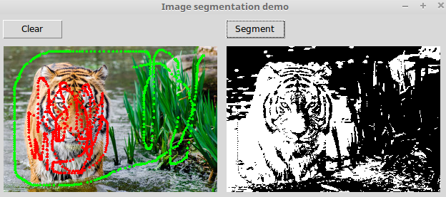

# Graph Cut Demo

Работа демонстрирует алгоритм сегментации изображений на основе минимального разреза графа.

## Установка

Зависимости:

- numpy
- Cython
- pymaxflow (https://github.com/Rhoana/pymaxflow)

## Запуск

``` bash
python graph_cut.py <path to image>
```

От пользователя требуется выделить с помошью мыши два опорных
множества пикселей - для переднего плана и фона. Передний план
выделяется при зажатой левой кнопке мыши, фон - при зажатой
правой кнопке. После выделения следует нажать кнопку "Segment".
Для сброса разметки и сегментации можно использовать кнопку
"Clear".

## Примеры




## Принцип работы

[TBD]